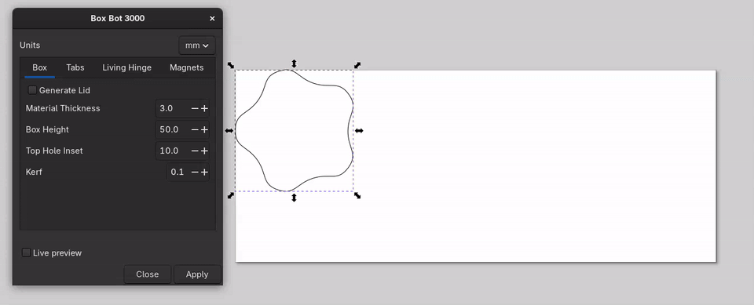
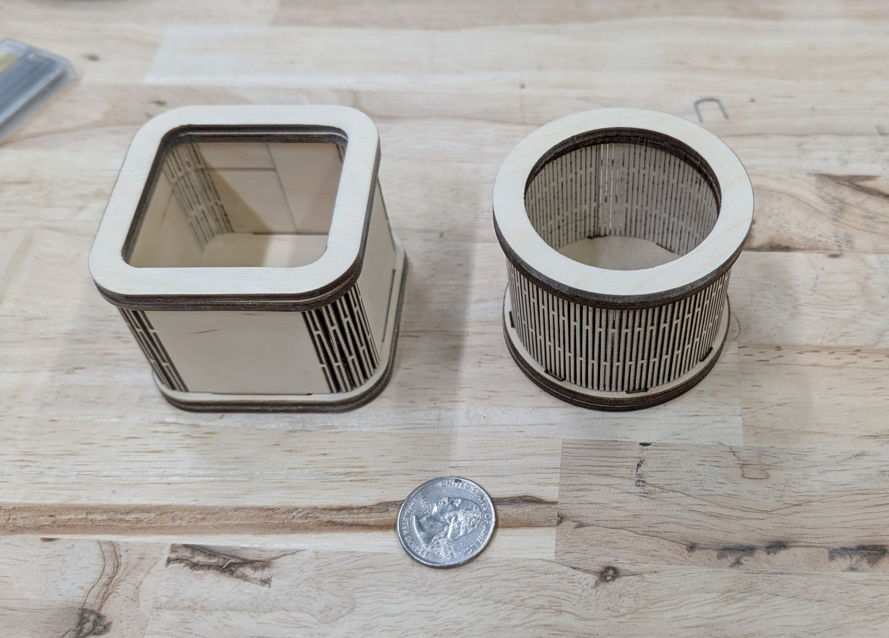

# Box Bot 3000

An highly opinionated Inkscape extension for generating laser-cut flexible boxes with living hinges. Create custom boxes from any closed path shape with interlocking tabs and living hinge patterns for curved sections.

## Manual Installation

1) Create a boxbot/ sub-directory in your Inkscape extensions directory:
   - Linux: `~/.config/inkscape/extensions/`
     - Flatpak: `~/.var/app/org.inkscape.Inkscape/config/inkscape/extensions/`
     - Snap: `~/snap/inkscape/current/.config/inkscape/extensions/`
   - macOS (Inkscape app bundle): `~/Library/Application Support/org.inkscape.Inkscape/config/inkscape/extensions/`
   - Windows: `%APPDATA%\Inkscape\extensions\`

2) Copy the files from this repo into that boxbot directory

3) Restart Inkscape, then find the extension under **Extensions > Laser Tools > Box Bot 3000**.

## Demo

## Example

## Acknowledgements

Inspiration, examples, and code from the following:

The Path2flex extension  
https://github.com/thierry7100/Path2flex

The built-in Inkscape extension Pattern Along Path  
https://gitlab.com/inkscape/extensions/-/blob/master/patternalongpath.py

Boxes.py  
https://boxes.hackerspace-bamberg.de

Meerk40t  
https://github.com/meerk40t/meerk40t